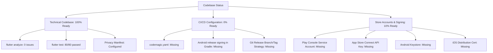
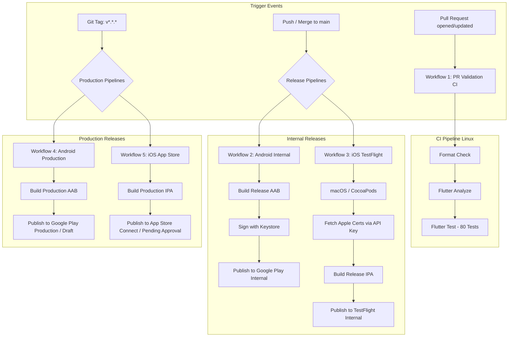
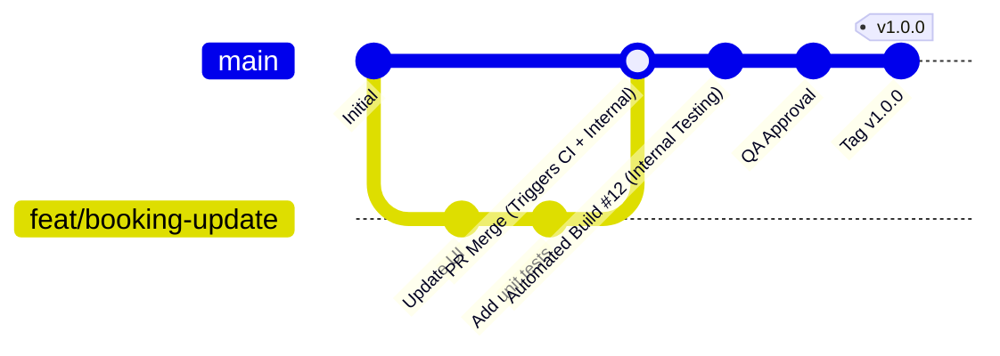

# Flutter Codemagic CI/CD Implementation Plan

**Application:** Younis (يونس) / younis Almurshid  
**Target Stores:** Google Play Store & Apple App Store / TestFlight  
**CI/CD Platform:** Codemagic  
**Document Version:** 1.0.0  
**Inspection Date:** September 25, 2026  
**Status:** DRAFT / PENDING EXECUTION  

---

## 1. Project Overview

The project is an on-demand medical and psychological therapy appointment and consultation mobile application named **"Younis" (يونس / younis Almurshid)**. The application allows patients to browse doctor profiles, select clinic visits or online psychological consultation sessions, schedule appointments, submit local payment receipts, and manage consultations.

### High-Level Architecture & Technical Stack
- **Framework:** Flutter (Targeting iOS and Android)
- **Dart SDK:** `>=3.11.5 <4.0.0` (as locked in `pubspec.lock`), environment constraint `^3.11.5` in `pubspec.yaml`
- **State Management:** BLoC / Cubit (`flutter_bloc: ^9.1.1`)
- **Dependency Injection:** Service Locator via GetIt (`get_it: ^8.2.0`)
- **Routing:** Declarative routing via GoRouter (`go_router: ^16.0.0`)
- **Network Layer:** Dio (`dio: ^5.8.0`) with dedicated logging and auth interceptors
- **Secure Persistence:** `flutter_secure_storage: ^9.2.4` (KeyStore on Android, Keychain on iOS)
- **General Persistence:** `shared_preferences: ^2.5.5`
- **Internationalization:** `easy_localization: ^3.0.8` supporting Arabic (`ar`) and English (`en`) with Cairo variable typography
- **Media & Hardware:** `image_picker: ^1.1.2` (used for payment receipt uploads from Camera and Photo Gallery)
- **Media Playback:** `youtube_player_flutter: ^9.1.1`
- **Code Generation:** **None** (No `build_runner`, `freezed`, or `json_serializable` dependencies present)
- **Firebase:** **None** (No Firebase SDKs, configuration files, or Google services plugins present)
- **Quality Baseline:** 80/80 automated unit & widget tests passing; `flutter analyze` reports 0 issues

---

## 2. Current Project State

### Flutter
- **Application Name in pubspec:** `younis_app`
- **Application Version:** `1.0.0`
- **Build Number:** `1` (`version: 1.0.0+1` in [pubspec.yaml](file:///d:/amir/projects/ox-tech/yonis-App/pubspec.yaml#L5))
- **Dart SDK Constraint:** `sdk: ^3.11.5`
- **Locked SDK Requirements:**
  - Dart: `>=3.11.5 <4.0.0`
  - Flutter: `>=3.38.4` (per [pubspec.lock](file:///d:/amir/projects/ox-tech/yonis-App/pubspec.lock#L1053-L1056))
- **Build Flavors:** None configured. Single scheme/target for Android and iOS.
- **Environment & Configuration Strategy:**
  - Implemented via `AppEnvironment` enum in [app_environment.dart](file:///d:/amir/projects/ox-tech/yonis-App/lib/app/config/app_environment.dart) (`development`, `staging`, `production`).
  - Passed at compile time using `--dart-define=APP_ENV=production|staging|development`.
  - Fallback logic: Automatically defaults to `production` when compiled in release mode (`kReleaseMode ? production : development`).
  - Configuration single source of truth: [app_config.dart](file:///d:/amir/projects/ox-tech/yonis-App/lib/app/config/app_config.dart) mapping base URLs (`https://younis-almurshid.com`) and disabling network payload logging in production.
- **Secret Management:**
  - No `.env` files are used in Flutter runtime.
  - Runtime tokens (JWT access & refresh tokens) are held in encrypted hardware storage via `FlutterSecureStorageImpl` ([secure_storage.dart](file:///d:/amir/projects/ox-tech/yonis-App/lib/core/storage/secure_storage.dart)).
- **Tests:**
  - Comprehensive suite under `test/` directory covering:
    - App entry & routing (`test/features/app_entry/`)
    - Authentication cubits & flows (`test/features/auth/`)
    - Booking flow (`test/features/booking/`)
    - Home & Reels (`test/features/home/`)
    - Profile management (`test/features/profile/`)
    - Services & Sessions (`test/features/services/`, `test/features/sessions/`)
  - Total tests: 80 passed (`flutter test`).
- **Static Analysis & Linting:**
  - Configured in [analysis_options.yaml](file:///d:/amir/projects/ox-tech/yonis-App/analysis_options.yaml) using `package:flutter_lints/flutter.yaml`.
  - Status: 0 lint errors, 0 warnings.
- **Native Plugins Requiring CI Configuration:**
  - `flutter_secure_storage`: Requires standard Keychain capability in iOS build settings.
  - `image_picker`: Requires `NSPhotoLibraryUsageDescription` and `NSCameraUsageDescription` on iOS (both present in `Info.plist`).
  - `url_launcher`: Requires `<queries>` declarations on Android 11+ (API 30+) in `AndroidManifest.xml` (present for `https` and `http`).

### Android
- **Application ID / Package Name:** `com.younis.younis_app` (configured in [build.gradle.kts](file:///d:/amir/projects/ox-tech/yonis-App/android/app/build.gradle.kts#L24))
- **Namespace:** `com.younis.younis_app` (configured in [build.gradle.kts](file:///d:/amir/projects/ox-tech/yonis-App/android/app/build.gradle.kts#L9))
- **Application Label:** `younis Almurshid` (in [AndroidManifest.xml](file:///d:/amir/projects/ox-tech/yonis-App/android/app/src/main/AndroidManifest.xml#L4))
- **SDK Versions:**
  - `compileSdk = flutter.compileSdkVersion`
  - `minSdk = flutter.minSdkVersion` (Flutter default: 21)
  - `targetSdk = flutter.targetSdkVersion` (Flutter default: 34 or 35)
  - `ndkVersion = flutter.ndkVersion`
- **Gradle & Build Toolchain:**
  - **Android Gradle Plugin (AGP):** `8.11.1` (in [settings.gradle.kts](file:///d:/amir/projects/ox-tech/yonis-App/android/settings.gradle.kts#L22))
  - **Kotlin Version:** `2.2.20` (`org.jetbrains.kotlin.android` in [settings.gradle.kts](file:///d:/amir/projects/ox-tech/yonis-App/android/settings.gradle.kts#L23))
  - **Gradle Wrapper Version:** `8.14` (`gradle-8.14-all.zip` in [gradle-wrapper.properties](file:///d:/amir/projects/ox-tech/yonis-App/android/gradle/wrapper/gradle-wrapper.properties#L5))
  - **Java / JDK Requirements:** JDK 17 (`JavaVersion.VERSION_17` specified for sourceCompatibility, targetCompatibility, and kotlin jvmTarget).
- **Signing Configuration:**
  - Currently in [build.gradle.kts](file:///d:/amir/projects/ox-tech/yonis-App/android/app/build.gradle.kts#L33-L39):
    ```kotlin
    buildTypes {
        release {
            // TODO: Add your own signing config for the release build.
            // Signing with the debug keys for now, so `flutter run --release` works.
            signingConfig = signingConfigs.getByName("debug")
        }
    }
    ```
  - **CRITICAL:** Release builds currently sign with debug keys. There is no `release` signingConfig block, nor is there a `key.properties` loading mechanism.
- **Keystore References:** No keystore files or references exist in the repository.
- **Product Flavors:** None (`defaultConfig` only).
- **Build Types:** `debug` and `release`.
- **ProGuard / R8:** Standard Flutter R8 compilation; no custom `proguard-rules.pro` file present.
- **Firebase:** None.
- **Permissions:** Minimized to `android.permission.INTERNET` only.

### iOS
- **Bundle Identifier:** `com.younis.younisApp` (defined in [project.pbxproj](file:///d:/amir/projects/ox-tech/yonis-App/ios/Runner.xcodeproj/project.pbxproj#L554))  
  *(Note: Notice the camelCase `com.younis.younisApp` on iOS vs snake_case `com.younis.younis_app` on Android).*
- **Display Name:** `younis Almurshid` (in [Info.plist](file:///d:/amir/projects/ox-tech/yonis-App/ios/Runner/Info.plist#L14))
- **iOS Deployment Target:** `13.0` (`IPHONEOS_DEPLOYMENT_TARGET = 13.0` in [project.pbxproj](file:///d:/amir/projects/ox-tech/yonis-App/ios/Runner.xcodeproj/project.pbxproj#L479))
- **Xcode Requirements:** Xcode 15+ (Project scheme format `LastUpgradeVersion = 1510`; recommended runner: Xcode 15.4 or Xcode 16 on macOS Sonoma/Sequoia).
- **Swift Version:** `5.0` (`SWIFT_VERSION = 5.0`).
- **CocoaPods & Podfile:**
  - No `Podfile` or `Podfile.lock` is currently committed in `ios/`.
  - Flutter generates the Podfile upon first invocation of `flutter build ios --config-only` or `pod install`.
- **Signing Configuration in Xcode Project:**
  - `CODE_SIGN_IDENTITY[sdk=iphoneos*] = "iPhone Developer"`
  - `DEVELOPMENT_TEAM = ""` (Not set / empty)
  - `PROVISIONING_PROFILE_SPECIFIER = ""` (Not set / empty)
  - `CODE_SIGN_STYLE = Automatic` (Xcode default)
- **Schemes:** 1 shared scheme (`Runner.xcscheme`), archiving target `Runner.app` under `Release` build configuration.
- **Privacy Manifest:** [PrivacyInfo.xcprivacy](file:///d:/amir/projects/ox-tech/yonis-App/ios/Runner/PrivacyInfo.xcprivacy) is present and compliant with Apple's Spring 2024 mandates:
  - `NSPrivacyTracking`: `false`
  - `NSPrivacyAccessedAPITypes`: `NSPrivacyAccessedAPICategoryUserDefaults` with reason `CA92.1`
- **Capabilities & Entitlements:**
  - No custom `.entitlements` file exists.
  - Push Notifications: Not used.
  - Background Modes: None.
  - Associated Domains / Universal Links: None.
  - Sign in with Apple: None.
  - Apple Pay: None.
  - In-App Purchase: Not used (professional medical/psychological consultations are exempt under Apple Guideline 3.1.3(e)).

### Git / Repository
- **Hosting Provider:** GitHub (`https://github.com/oxtechuk/yonis-App.git`)
- **Repository Structure:**
  - Workspace `ox-tech/` contains two projects: `yonis` (Laravel API backend) and `yonis-App` (Flutter application).
  - The Git repository for the mobile app is rooted directly at `yonis-App`.
  - Codemagic will connect directly to the `oxtechuk/yonis-App` GitHub repository.
- **Local & Remote Branches:** `main` (synced with `origin/main`).
- **Existing CI/CD:** No CI/CD configuration exists (no `.github/workflows`, `.gitlab-ci.yml`, `bitbucket-pipelines.yml`, or `codemagic.yaml`).
- **Existing Tags:** No Git tags exist yet.
- **.gitignore Status:**
  - Standard Flutter `.gitignore` is present.
  - **Security Gap:** Missing explicit rules for `key.properties`, `*.jks`, `*.keystore`, `*.p12`, `*.mobileprovision`, `*.p8`, and Google service JSON/plist files.

---

## 3. Current Release Readiness



### Already Configured
- [x] Application name, launcher icons (`assets/images/app_logo.png`), and portrait orientation locking.
- [x] Production environment fallback (`AppEnvironment.production` default for release builds pointing to `https://younis-almurshid.com`).
- [x] Network security: Network payload logging disabled automatically in production mode.
- [x] Android permissions minimized (`INTERNET` only).
- [x] iOS Privacy Manifest (`PrivacyInfo.xcprivacy` with reason `CA92.1`).
- [x] Photo & Camera permission usage descriptions in `Info.plist`.
- [x] Static analysis cleanliness (0 analyzer errors or warnings).
- [x] Automated test suite (80 unit and widget tests passing).
- [x] Arabic and English translations and font assets bundled.

### Missing
- [ ] `codemagic.yaml` pipeline definition file in repository root.
- [ ] Production Android signing configuration in `android/app/build.gradle.kts` (support for `key.properties` and Codemagic injected signing variables).
- [ ] Android Release Keystore (`.jks` / `.keystore`) generated and secured.
- [ ] Google Play Service Account JSON credentials for automated CI publishing.
- [ ] Apple App Store Connect API Key (`.p8`, Key ID, Issuer ID) for automated code signing and TestFlight publishing.
- [ ] Apple Distribution Certificate and App Store Provisioning Profile (or automated creation via Codemagic API key integration).
- [ ] Codemagic Project connection and Environment Variable Groups setup.
- [ ] Hardened `.gitignore` rules for keystores, key properties, and certificates.
- [ ] Initial CocoaPods setup (`Podfile`) on a macOS runner.

### Needs Verification
- [ ] **Application ID vs Bundle ID Discrepancy:**
  - Android: `com.younis.younis_app`
  - iOS: `com.younis.younisApp`
  - *Must verify:* Have these exact IDs already been registered in the Google Play Console and Apple Developer Portal? If registered, they can remain as-is. If not yet registered, verify whether they should be aligned.
- [ ] **External Backend Dependencies (tracked in `RELEASE_BLOCKERS_AND_EXTERNAL_DEPENDENCIES.md`):**
  - Account deletion production endpoint confirmation with backend team (`DELETE /api/user`).
  - Account deletion public web page deployment (`https://younis-almurshid.com/delete-account`).
- [ ] **Google Play Target SDK Requirement:**
  - Google Play requires targeting Android 14 (API level 34) or higher for new app submissions. Verified that current Flutter toolchain targets API 34+.

### Manual External Setup (Outside Repository)
1. **Google Play Console:**
   - Create Google Play Developer account and register the application.
   - Complete Google Play App Signing enrollment.
   - Create Google Cloud Service Account with Google Play Android Developer API access and invite it as an Admin/Release Manager user in Play Console.
   - **Crucial Rule:** Perform the **first manual upload** of the initial signed `.aab` directly in the Google Play Console UI (Google Play API rejects automated uploads for apps that have never had a release artifact uploaded manually).
   - Complete Data Safety Questionnaire, Content Rating, and Privacy Policy URL (`https://younis-almurshid.com/privacy`).
2. **Apple Developer Portal & App Store Connect:**
   - Enroll in Apple Developer Program.
   - Register App ID: `com.younis.younisApp`.
   - Create App Store Connect App Record with primary language Arabic and secondary English.
   - Generate App Store Connect API Key with **App Manager** access (Key ID, Issuer ID, `.p8` file).
   - Complete App Privacy questionnaire, Age Rating, Pricing, and Support URLs.

---

## 4. Target CI/CD Architecture

The recommended CI/CD architecture implements separate, purpose-built workflows within a single `codemagic.yaml` file to optimize build times, conserve macOS machine minutes, and maintain strict release safety.



### Workflow Summary Matrix

| Workflow ID | Name | Runner VM | Triggers | Artifacts Generated | Publishing Target |
| :--- | :--- | :--- | :--- | :--- | :--- |
| `pr-validation` | PR Quality Check | Linux (`linux_x2`) | PRs to `main` | Test reports | None (Status check only) |
| `android-internal` | Android Internal Release | Linux (`linux_x2`) | Push to `main`, Manual | Signed `.aab` | Google Play Internal Track |
| `ios-testflight` | iOS TestFlight Release | macOS (`mac_mini_m2`) | Push to `main`, Manual | Signed `.ipa` | TestFlight (Internal testers) |
| `android-production`| Android Store Release | Linux (`linux_x2`) | Tag `v*.*.*`, Manual | Signed `.aab` | Google Play Production / Draft |
| `ios-production` | iOS App Store Release | macOS (`mac_mini_m2`) | Tag `v*.*.*`, Manual | Signed `.ipa` | App Store Connect (Review) |

---

## 5. Recommended Branch and Release Strategy

Based on the inspection of the repository (single `main` branch, small agile team, direct feature integration), a **Trunk-Based Release Flow with Release Tagging** is recommended:



### Branching Rules
1. **`main` Branch:**
   - The protected trunk. Direct commits are restricted.
   - All changes enter via Pull Requests from feature branches (`feat/*`, `fix/*`, `refactor/*`).
   - Every commit on `main` must pass tests and is automatically deployed to **Google Play Internal Track** and **Apple TestFlight**.
2. **Feature Branches (`feat/*`, `fix/*`):**
   - Short-lived developer branches.
   - Opening a PR against `main` triggers the lightweight, fast `pr-validation` workflow on a Linux machine.
3. **Release Tags (`vMAJOR.MINOR.PATCH`):**
   - Production releases are never created ad-hoc. They are initiated strictly by pushing a signed Git tag following Semantic Versioning (e.g., `v1.0.0`, `v1.0.1`, `v1.1.0`).
   - Pushing tag `v1.0.1` triggers `android-production` and `ios-production` workflows.

---

## 6. Secrets and Credentials Architecture

All sensitive credentials will be stored securely in **Codemagic Environment Variable Groups** and injected dynamically during builds. No secrets, keys, or credentials will be committed to Git.

### Credentials Inventory & Allocation Table

| Secret Variable Name | Purpose | Target Workflow | Variable Group | Storage Type | Committed to Git? |
| :--- | :--- | :--- | :--- | :--- | :--- |
| `CM_KEYSTORE` | Android Release Keystore | Android Internal & Prod | `android_signing` | Secure File (or Base64) | **NEVER** |
| `CM_KEYSTORE_PASSWORD` | Keystore master password | Android Internal & Prod | `android_signing` | Masked String | **NEVER** |
| `CM_KEY_ALIAS` | Release key entry alias | Android Internal & Prod | `android_signing` | Masked String | **NEVER** |
| `CM_KEY_PASSWORD` | Release key password | Android Internal & Prod | `android_signing` | Masked String | **NEVER** |
| `GCLOUD_SERVICE_ACCOUNT_CREDENTIALS` | Google Play Publishing API JSON Key | Android Internal & Prod | `google_play_credentials` | Secure Text / Masked | **NEVER** |
| `APP_STORE_CONNECT_KEY_IDENTIFIER` | App Store Connect API Key ID (e.g. `2X9R427DGU`) | iOS TestFlight & Prod | `app_store_credentials` | Masked String | **NEVER** |
| `APP_STORE_CONNECT_ISSUER_ID` | App Store Connect Issuer UUID | iOS TestFlight & Prod | `app_store_credentials` | Masked String | **NEVER** |
| `APP_STORE_CONNECT_PRIVATE_KEY` | App Store Connect `.p8` private key contents | iOS TestFlight & Prod | `app_store_credentials` | Secure Text / Masked | **NEVER** |
| `CERTIFICATE_PRIVATE_KEY` | RSA 2048-bit Private Key for Apple Distribution Cert | iOS TestFlight & Prod | `app_store_credentials` | Secure Text / Masked | **NEVER** |

### Local vs CI Credential Separation
- **Local Developers:** Do NOT need production distribution certificates, App Store API keys, or Google Play service account keys.
- **Local Android Release Testing:** Developers sign release APKs using standard debug keystore (`signingConfig = signingConfigs.getByName("debug")` fallback) or a local non-production keystore.
- **CI Build Machine:** Dynamically reads secrets from Codemagic environment variables, creates temporary files in ephemeral build storage, signs artifacts, and purges the environment on build completion.

---

## 7. Versioning Strategy

### The Dual Versioning Problem
Flutter applications require two separate version identifiers:
1. **Marketing Version (`versionName` / `CFBundleShortVersionString`):** User-facing version (e.g. `1.0.0`).
2. **Build Number (`versionCode` / `CFBundleVersion`):** Monotonically increasing positive integer required by Google Play and App Store Connect (e.g. `1`, `2`, `3`).
   - *Google Play Rule:* Every new AAB uploaded to any track must have a `versionCode` strictly greater than all previous uploads.
   - *App Store Rule:* Every new build uploaded for the same marketing version must have a unique, incremented `CFBundleVersion`.

### Proposed Dynamic Versioning Mechanism
Rather than manually modifying `pubspec.yaml` on every single commit, Codemagic will compute the build number dynamically at build time and inject it into Flutter's build command:

$$\text{Build Version} = \text{Marketing Version} + \text{Dynamically Resolved Build Number}$$

#### Android Build Number Calculation:
Using Codemagic's built-in `google-play get-latest-build-number` CLI command:
```bash
LATEST_STORE_BUILD=$(google-play get-latest-build-number --package-name "com.younis.younis_app" || echo 0)
BUILD_NUMBER=$((LATEST_STORE_BUILD + 1))
```
*Fallback:* If no build exists on Google Play yet (first release), default to `BUILD_NUMBER=1` (or Codemagic's `$PROJECT_BUILD_NUMBER`).

#### iOS Build Number Calculation:
Using Codemagic's built-in `app-store-connect get-latest-app-store-build-number` CLI command:
```bash
LATEST_STORE_BUILD=$(app-store-connect get-latest-app-store-build-number "com.younis.younisApp" || echo 0)
BUILD_NUMBER=$((LATEST_STORE_BUILD + 1))
```

#### Marketing Version Resolution:
- For **Tagged Releases** (e.g. tag `v1.0.0`): The marketing version is extracted directly from the Git tag (`${TAG_NAME#v}`).
- For **Trunk Builds** (on `main`): The marketing version is read from `pubspec.yaml` (e.g. `1.0.0`).

#### Command Injection:
```bash
flutter build appbundle --release \
  --build-name="$MARKETING_VERSION" \
  --build-number="$BUILD_NUMBER" \
  --dart-define=APP_ENV=production
```
and
```bash
flutter build ipa --release \
  --build-name="$MARKETING_VERSION" \
  --build-number="$BUILD_NUMBER" \
  --dart-define=APP_ENV=production \
  --export-options-plist=$HOME/export_options.plist
```

---

## 8. Proposed Codemagic Workflows

### Workflow 1: `pr-validation` (Pull Request CI)
- **Goal:** Fast, rigorous quality gate for all pull requests.
- **Instance:** Linux standard (`linux_x2`).
- **Triggers:** Pull requests to `main`.
- **Steps:**
  1. Initialize Flutter environment (`flutter --version`).
  2. Install dependencies (`flutter pub get`).
  3. Validate code formatting (`dart format --output=none --set-exit-if-changed .`).
  4. Run static analyzer (`flutter analyze --fatal-infos`).
  5. Execute complete test suite (`flutter test`).
- **Artifacts:** Test execution summary.
- **Publishing:** None.

### Workflow 2: `android-internal` (Google Play Internal Release)
- **Goal:** Deliver an automated build to Google Play Internal App Sharing / Internal Testing on every merge to `main`.
- **Instance:** Linux standard (`linux_x2`).
- **Triggers:** Push to `main` branch.
- **Environment Groups:** `android_signing`, `google_play_credentials`.
- **Steps:**
  1. `flutter pub get`
  2. Run `flutter test`
  3. Query latest Google Play `versionCode` and increment.
  4. Generate temporary `key.properties` from `$CM_KEYSTORE_PATH`, `$CM_KEYSTORE_PASSWORD`, etc.
  5. Build signed release App Bundle (`flutter build appbundle --release`).
- **Artifacts:** `build/app/outputs/bundle/release/app-release.aab`
- **Publishing:** Google Play track: `internal`.

### Workflow 3: `ios-testflight` (Apple TestFlight Release)
- **Goal:** Deliver an automated build to TestFlight for internal testers on every merge to `main`.
- **Instance:** macOS standard (`mac_mini_m2`).
- **Triggers:** Push to `main` branch.
- **Environment Groups:** `app_store_credentials`.
- **Steps:**
  1. Set up temporary macOS Keychain (`keychain initialize`).
  2. Fetch certificates and provisioning profiles via App Store Connect API (`app-store-connect fetch-signing-files "com.younis.younisApp" --type IOS_APP_STORE --create`).
  3. Add certificates to Keychain (`keychain add-certificates`).
  4. Apply profiles to Xcode project (`xcode-project use-profiles`).
  5. Query latest TestFlight build number and increment.
  6. `flutter pub get`
  7. Build signed release IPA (`flutter build ipa --release`).
- **Artifacts:** `build/ios/ipa/*.ipa`
- **Publishing:** App Store Connect TestFlight (internal testing group).

### Workflow 4: `android-production` (Google Play Production Release)
- **Goal:** Build and release candidate for Google Play production track upon official release tagging.
- **Instance:** Linux standard (`linux_x2`).
- **Triggers:** Git tag matching `v[0-9]+.[0-9]+.[0-9]+*`.
- **Environment Groups:** `android_signing`, `google_play_credentials`.
- **Steps:** Same as Android internal, but publishing to track: `production` with `submit_as_draft: true` (ensuring release manager must perform final rollout confirmation in Play Console).

### Workflow 5: `ios-production` (App Store Submission)
- **Goal:** Build and submit release candidate to App Store Connect for App Store Review upon official release tagging.
- **Instance:** macOS standard (`mac_mini_m2`).
- **Triggers:** Git tag matching `v[0-9]+.[0-9]+.[0-9]+*`.
- **Environment Groups:** `app_store_credentials`.
- **Steps:** Same as iOS TestFlight, but publishing to App Store Connect with `submit_to_testflight: false` and `submit_to_app_store: true`.

---

## 9. Proposed codemagic.yaml Structure

*(Reference only — do NOT create this file in this phase)*

```yaml
# ==============================================================================
# Younis Application — Codemagic CI/CD Pipeline Configuration
# Repositories: https://github.com/oxtechuk/yonis-App
# ==============================================================================

workflows:
  # ----------------------------------------------------------------------------
  # 1. PULL REQUEST VALIDATION WORKFLOW
  # ----------------------------------------------------------------------------
  pr-validation:
    name: PR Quality & Test Validation
    instance_type: linux_x2
    max_build_duration: 15
    triggering:
      events:
        - pull_request
      branch_patterns:
        - pattern: main
          include: true
          source: true
      cancel_previous_builds: true
    environment:
      flutter: stable
    scripts:
      - name: Install dependencies
        script: flutter pub get
      - name: Verify code formatting
        script: dart format --output=none --set-exit-if-changed .
      - name: Run static analysis
        script: flutter analyze --fatal-infos
      - name: Run automated test suite
        script: flutter test

  # ----------------------------------------------------------------------------
  # 2. ANDROID INTERNAL RELEASE WORKFLOW
  # ----------------------------------------------------------------------------
  android-internal:
    name: Android Internal Track Release
    instance_type: linux_x2
    max_build_duration: 30
    triggering:
      events:
        - push
      branch_patterns:
        - pattern: main
          include: true
    environment:
      groups:
        - android_signing
        - google_play_credentials
      flutter: stable
      java: 17
    scripts:
      - name: Install dependencies
        script: flutter pub get
      - name: Run test suite
        script: flutter test
      - name: Set up Android keystore & key.properties
        script: |
          echo "$CM_KEYSTORE" | base64 --decode > /tmp/release.keystore
          cat <<EOF > android/key.properties
          storePassword=$CM_KEYSTORE_PASSWORD
          keyPassword=$CM_KEY_PASSWORD
          keyAlias=$CM_KEY_ALIAS
          storeFile=/tmp/release.keystore
          EOF
      - name: Determine dynamic build number
        script: |
          LATEST_BUILD=$(google-play get-latest-build-number --package-name "com.younis.younis_app" || echo 0)
          NEW_BUILD=$((LATEST_BUILD + 1))
          echo "NEW_BUILD=$NEW_BUILD" >> $CM_ENV
      - name: Build Android App Bundle (AAB)
        script: |
          flutter build appbundle --release \
            --build-number=$NEW_BUILD \
            --dart-define=APP_ENV=production
    artifacts:
      - build/app/outputs/bundle/release/*.aab
    publishing:
      google_play:
        credentials: $GCLOUD_SERVICE_ACCOUNT_CREDENTIALS
        track: internal
        submit_as_draft: false

  # ----------------------------------------------------------------------------
  # 3. IOS TESTFLIGHT RELEASE WORKFLOW
  # ----------------------------------------------------------------------------
  ios-testflight:
    name: iOS TestFlight Release
    instance_type: mac_mini_m2
    max_build_duration: 45
    triggering:
      events:
        - push
      branch_patterns:
        - pattern: main
          include: true
    environment:
      groups:
        - app_store_credentials
      flutter: stable
      xcode: latest
      cocoapods: default
    scripts:
      - name: Initialize Keychain & Code Signing
        script: |
          keychain initialize
          app-store-connect fetch-signing-files "com.younis.younisApp" \
            --type IOS_APP_STORE \
            --create
          keychain add-certificates
          xcode-project use-profiles
      - name: Determine dynamic iOS build number
        script: |
          LATEST_BUILD=$(app-store-connect get-latest-app-store-build-number "com.younis.younisApp" || echo 0)
          NEW_BUILD=$((LATEST_BUILD + 1))
          echo "NEW_BUILD=$NEW_BUILD" >> $CM_ENV
      - name: Install dependencies
        script: flutter pub get
      - name: Run test suite
        script: flutter test
      - name: Build iOS IPA
        script: |
          flutter build ipa --release \
            --build-number=$NEW_BUILD \
            --dart-define=APP_ENV=production \
            --export-options-plist=$HOME/export_options.plist
    artifacts:
      - build/ios/ipa/*.ipa
    publishing:
      app_store_connect:
        auth: integration
        submit_to_testflight: true

  # ----------------------------------------------------------------------------
  # 4. ANDROID PRODUCTION STORE RELEASE WORKFLOW
  # ----------------------------------------------------------------------------
  android-production:
    name: Android Production Release
    instance_type: linux_x2
    max_build_duration: 30
    triggering:
      events:
        - tag
      tag_patterns:
        - pattern: 'v[0-9]+.[0-9]+.[0-9]+*'
          include: true
    environment:
      groups:
        - android_signing
        - google_play_credentials
      flutter: stable
      java: 17
    scripts:
      - name: Install dependencies & run tests
        script: |
          flutter pub get
          flutter test
      - name: Set up keystore
        script: |
          echo "$CM_KEYSTORE" | base64 --decode > /tmp/release.keystore
          cat <<EOF > android/key.properties
          storePassword=$CM_KEYSTORE_PASSWORD
          keyPassword=$CM_KEY_PASSWORD
          keyAlias=$CM_KEY_ALIAS
          storeFile=/tmp/release.keystore
          EOF
      - name: Extract marketing version & build number
        script: |
          VERSION_TAG=${CM_TAG#v}
          LATEST_BUILD=$(google-play get-latest-build-number --package-name "com.younis.younis_app" || echo 0)
          NEW_BUILD=$((LATEST_BUILD + 1))
          echo "VERSION_TAG=$VERSION_TAG" >> $CM_ENV
          echo "NEW_BUILD=$NEW_BUILD" >> $CM_ENV
      - name: Build Production AAB
        script: |
          flutter build appbundle --release \
            --build-name=$VERSION_TAG \
            --build-number=$NEW_BUILD \
            --dart-define=APP_ENV=production
    artifacts:
      - build/app/outputs/bundle/release/*.aab
    publishing:
      google_play:
        credentials: $GCLOUD_SERVICE_ACCOUNT_CREDENTIALS
        track: production
        submit_as_draft: true

  # ----------------------------------------------------------------------------
  # 5. IOS APP STORE PRODUCTION RELEASE WORKFLOW
  # ----------------------------------------------------------------------------
  ios-production:
    name: iOS App Store Production Release
    instance_type: mac_mini_m2
    max_build_duration: 45
    triggering:
      events:
        - tag
      tag_patterns:
        - pattern: 'v[0-9]+.[0-9]+.[0-9]+*'
          include: true
    environment:
      groups:
        - app_store_credentials
      flutter: stable
      xcode: latest
      cocoapods: default
    scripts:
      - name: Initialize Keychain & Signing
        script: |
          keychain initialize
          app-store-connect fetch-signing-files "com.younis.younisApp" \
            --type IOS_APP_STORE \
            --create
          keychain add-certificates
          xcode-project use-profiles
      - name: Extract marketing version & build number
        script: |
          VERSION_TAG=${CM_TAG#v}
          LATEST_BUILD=$(app-store-connect get-latest-app-store-build-number "com.younis.younisApp" || echo 0)
          NEW_BUILD=$((LATEST_BUILD + 1))
          echo "VERSION_TAG=$VERSION_TAG" >> $CM_ENV
          echo "NEW_BUILD=$NEW_BUILD" >> $CM_ENV
      - name: Install dependencies & run tests
        script: |
          flutter pub get
          flutter test
      - name: Build Production IPA
        script: |
          flutter build ipa --release \
            --build-name=$VERSION_TAG \
            --build-number=$NEW_BUILD \
            --dart-define=APP_ENV=production \
            --export-options-plist=$HOME/export_options.plist
    artifacts:
      - build/ios/ipa/*.ipa
    publishing:
      app_store_connect:
        auth: integration
        submit_to_testflight: false
        submit_to_app_store: true
```

---

## 10. Google Play Setup Checklist

| Phase | Action Item | Target System | Execution Scope |
| :--- | :--- | :--- | :--- |
| **Prerequisites** | Generate release Keystore (`younis_release.keystore`) | LOCAL | Machine owner |
| **Prerequisites** | Store Keystore, Alias, and Passwords in secure password manager | LOCAL | Security Owner |
| **Console Setup** | Create new application in Google Play Console with Package ID `com.younis.younis_app` | GOOGLE PLAY CONSOLE | Store Admin |
| **Console Setup** | Complete Store Listing (App Title "younis Almurshid", Short & Full Description in Arabic & English, 512x512 Icon, Feature Graphic, Screenshots) | GOOGLE PLAY CONSOLE | Marketing/Product |
| **Console Setup** | Complete Content Rating, Target Audience, and Privacy Policy URL (`https://younis-almurshid.com/privacy`) | GOOGLE PLAY CONSOLE | Legal/Product |
| **Console Setup** | Complete Data Safety questionnaire (using declarations verified in `RELEASE_BLOCKERS_AND_EXTERNAL_DEPENDENCIES.md`) | GOOGLE PLAY CONSOLE | Store Admin |
| **API Access** | Create Google Cloud Project (or link existing) and enable **Google Play Android Developer API** | GOOGLE CLOUD CONSOLE | GCP Admin |
| **API Access** | Create dedicated Service Account (`codemagic-publisher@...`) and generate private JSON Key | GOOGLE CLOUD CONSOLE | GCP Admin |
| **API Access** | Invite Service Account email to Play Console with "Admin" or "Releases" permissions | GOOGLE PLAY CONSOLE | Play Console Admin |
| **First Release** | **Build first signed AAB locally and manually upload it to Internal Testing track** | GOOGLE PLAY CONSOLE | Release Manager |
| **Codemagic Setup**| Create `android_signing` environment variable group in Codemagic (`CM_KEYSTORE`, passwords, alias) | CODEMAGIC | CI Admin |
| **Codemagic Setup**| Create `google_play_credentials` environment variable group (`GCLOUD_SERVICE_ACCOUNT_CREDENTIALS`) | CODEMAGIC | CI Admin |
| **Automation** | Trigger `android-internal` workflow to verify automated build and upload to Internal Track | CODEMAGIC | CI Admin |

---

## 11. Apple / App Store Setup Checklist

| Phase | Action Item | Target System | Execution Scope |
| :--- | :--- | :--- | :--- |
| **Prerequisites** | Enroll in Apple Developer Program | APPLE DEVELOPER PORTAL | Account Holder |
| **App ID** | Register App ID with Bundle Identifier `com.younis.younisApp` | APPLE DEVELOPER PORTAL | Account Admin |
| **App Store Record**| Create new App Record in App Store Connect with Bundle ID `com.younis.younisApp` and SKU `YOUNIS-APP-01` | APP STORE CONNECT | Store Admin |
| **Store Metadata** | Configure App Name, Subtitle, Privacy Policy URL (`https://younis-almurshid.com/privacy`), Support URL | APP STORE CONNECT | Marketing/Product |
| **API Access** | Generate App Store Connect API Key with **App Manager** role | APP STORE CONNECT | Account Admin |
| **API Access** | Save Key ID, Issuer ID, and download `.p8` private key file (available only once) | APP STORE CONNECT | Security Owner |
| **Signing Setup** | Generate Apple Distribution Certificate & App Store Provisioning Profile (or delegate to Codemagic) | APPLE DEVELOPER / CODEMAGIC | CI Admin |
| **Codemagic Setup**| Add App Store Connect API Key integration in Codemagic Team Settings | CODEMAGIC | CI Admin |
| **Codemagic Setup**| Add `app_store_credentials` group in Codemagic (`APP_STORE_CONNECT_KEY_IDENTIFIER`, `APP_STORE_CONNECT_ISSUER_ID`, `APP_STORE_CONNECT_PRIVATE_KEY`) | CODEMAGIC | CI Admin |
| **First Release** | Run initial `ios-testflight` build in Codemagic to verify code signing, IPA packaging, and TestFlight delivery | CODEMAGIC | CI Admin |
| **Compliance** | Complete Export Compliance questions in App Store Connect (standard HTTPS encryption, exempt) | APP STORE CONNECT | Store Admin |

---

## 12. Security Review

### Audit Findings
1. **Committed Secrets & Keystores:**
   - Thorough repository scan confirmed **zero** keystore files (`*.jks`, `*.keystore`), certificates (`*.p12`, `*.mobileprovision`, `*.p8`), or `.env` files are present in the Git history or current working tree.
2. **Repository .gitignore Vulnerability:**
   - The current [.gitignore](file:///d:/amir/projects/ox-tech/yonis-App/.gitignore) lacks explicit rules for Android signing properties (`key.properties`), keystores, and Apple certificates.
   - *Risk:* A developer generating a local keystore or `key.properties` for testing could accidentally commit it to Git.
3. **Android Release Signing Fallback:**
   - In [android/app/build.gradle.kts](file:///d:/amir/projects/ox-tech/yonis-App/android/app/build.gradle.kts#L37), `release` build type signs with debug keys by default.
   - *Remediation:* Update `build.gradle.kts` to conditionally load `key.properties` when available and sign release builds properly, falling back gracefully to debug keys for local development if `key.properties` is absent.
4. **Log Sanitization:**
   - Verified that [app_config.dart](file:///d:/amir/projects/ox-tech/yonis-App/lib/app/config/app_config.dart#L51) disables Dio network body logging when `isProduction` is true (`enableNetworkLogs: !environment.isProduction`).
5. **CI Secret Echoing:**
   - In all proposed Codemagic scripts, secrets are piped directly to files or tools without using `echo $SECRET` in non-file commands to avoid exposing secrets in Codemagic build logs.

---

## 13. Ordered Implementation Roadmap

The implementation roadmap is broken into 12 discrete, independently actionable, and verifiable steps. We will execute exactly one step at a time in subsequent phases.

---

### Step 1 — Harden .gitignore and Repository Prerequisites
- **Status:** NOT_STARTED
- **Objective:** Ensure no signing credentials, keystores, provisioning profiles, or environment files can ever be accidentally committed to Git.
- **Prerequisites:** Git repository inspection completed.
- **Files affected:** `yonis-App/.gitignore`
- **External systems:** None.
- **Actions:**
  - Add explicit rules to `.gitignore` for `*.jks`, `*.keystore`, `android/key.properties`, `*.p12`, `*.mobileprovision`, `*.p8`, `*.cer`, `*.pem`, and `.env*`.
- **Expected result:** Git ignores any generated signing assets and key configuration files.
- **Verification:** Create dummy `android/key.properties` and dummy `test.keystore`, run `git status`, confirm they are untracked and ignored, then delete dummy files.
- **Failure scenarios:** Syntactic typo in `.gitignore` breaks Git tracking.
- **Rollback:** Revert changes to `.gitignore` via `git checkout -- .gitignore`.

---

### Step 2 — Configure Android Release Signing in Gradle
- **Status:** NOT_STARTED
- **Objective:** Update `android/app/build.gradle.kts` to load signing credentials from `key.properties` if present, while preserving debug signing as fallback for local developers without keys.
- **Prerequisites:** Step 1 completed.
- **Files affected:** `yonis-App/android/app/build.gradle.kts`
- **External systems:** None.
- **Actions:**
  - Add `key.properties` loading logic at the top of `android/app/build.gradle.kts`.
  - Define `signingConfigs { create("release") { ... } }` binding `storeFile`, `storePassword`, `keyAlias`, and `keyPassword`.
  - In `buildTypes { release { ... } }`, set `signingConfig = if (keyPropertiesFile.exists()) signingConfigs.getByName("release") else signingConfigs.getByName("debug")`.
- **Expected result:** When `key.properties` exists, Gradle signs with the release key; otherwise, it signs with debug keys.
- **Verification:** Run `./gradlew assembleDebug` and `./gradlew assembleRelease` to confirm syntax correctness and build success without `key.properties`.
- **Failure scenarios:** Kotlin DSL syntax errors in Gradle script.
- **Rollback:** `git checkout -- android/app/build.gradle.kts`.

---

### Step 3 — Verify and Prepare iOS Configuration & CocoaPods Baseline
- **Status:** NOT_STARTED
- **Objective:** Ensure iOS build settings and CocoaPods configurations are clean and ready for headless CI archive builds.
- **Prerequisites:** Step 1 completed.
- **Files affected:** `yonis-App/ios/Runner.xcodeproj/project.pbxproj` (and generated `ios/Podfile` if needed).
- **External systems:** macOS runner / CocoaPods.
- **Actions:**
  - Verify that `Runner.xcodeproj` build settings maintain `IPHONEOS_DEPLOYMENT_TARGET = 13.0` and `ENABLE_BITCODE = NO`.
  - Ensure CocoaPods installation and Podfile generation are documented and reproducible on macOS runners via `flutter build ios --config-only`.
- **Expected result:** Xcode project archives cleanly without interactive prompts.
- **Verification:** Review project configuration; confirm `Runner.xcscheme` is marked shared in `xcshareddata`.
- **Failure scenarios:** CocoaPods version mismatch or missing pod definitions.
- **Rollback:** Revert Xcode configuration changes.

---

### Step 4 — Generate Production Android Keystore & Record Credentials
- **Status:** NOT_STARTED
- **Objective:** Generate a production RSA 2048-bit release keystore for the Android app and secure its credentials.
- **Prerequisites:** Decisions on key alias, password complexity, and validity period (recommended: 25+ years).
- **Files affected:** Keystore file generated outside Git or in a secure temporary directory.
- **External systems:** Password Manager (1Password / Bitwarden / KeePass).
- **Actions:**
  - Run `keytool -genkey -v -keystore younis_release.keystore -alias younis_key -keyalg RSA -keysize 2048 -validity 10000`.
  - Store password, key password, alias, and keystore backup in the organization's secure vault.
  - Encode keystore to Base64 string for Codemagic injection: `[Convert]::ToBase64String([IO.File]::ReadAllBytes("younis_release.keystore"))`.
- **Expected result:** Production keystore generated; Base64 representation ready for Codemagic.
- **Verification:** Run `keytool -list -v -keystore younis_release.keystore` using the chosen password and verify alias `younis_key`.
- **Failure scenarios:** Lost password or corrupted keystore file.
- **Rollback:** Re-generate before enrolling with Google Play. Once uploaded to Google Play, the key cannot be changed without Play Console reset!

---

### Step 5 — Configure Google Play Console, API Access & Perform First Manual Upload
- **Status:** NOT_STARTED
- **Objective:** Register the application in Google Play Console, establish Google Cloud API service account credentials, and upload the first AAB manually.
- **Prerequisites:** Step 2, Step 4 completed; Google Play Developer Account active.
- **Files affected:** None in repo.
- **External systems:** Google Play Console, Google Cloud Console.
- **Actions:**
  - Create App: `com.younis.younis_app` in Google Play Console.
  - Enable Google Play Android Developer API in GCP.
  - Create Service Account and download JSON credentials.
  - Grant Service Account permissions in Play Console.
  - Build signed release AAB locally using Step 4 keystore.
  - Upload AAB manually to Google Play Internal Testing track.
- **Expected result:** App created, first AAB accepted by Google Play App Signing, service account active.
- **Verification:** Confirm first release appears in Play Console Internal Testing track and API access test passes.
- **Failure scenarios:** Package ID mismatch; missing Google Play questionnaire declarations.
- **Rollback:** Delete draft or update declarations in Console.

---

### Step 6 — Configure Apple Developer Portal & App Store Connect API Key
- **Status:** NOT_STARTED
- **Objective:** Register iOS App ID, create App Store Connect record, and generate an App Store Connect API Key.
- **Prerequisites:** Active Apple Developer Account.
- **Files affected:** None in repo.
- **External systems:** Apple Developer Portal, App Store Connect.
- **Actions:**
  - Register App ID: `com.younis.younisApp`.
  - Create App Record in App Store Connect.
  - In App Store Connect -> Users and Access -> Integrations -> App Store Connect API, create a key with "App Manager" role.
  - Secure Key ID, Issuer ID, and `.p8` private key file.
- **Expected result:** App Store Connect API key generated and ready for Codemagic automatic code signing.
- **Verification:** Validate key credentials using `app-store-connect` CLI or Codemagic UI test connection.
- **Failure scenarios:** Key revoked or missing App Manager permissions.
- **Rollback:** Revoke key in App Store Connect and generate a new one.

---

### Step 7 — Connect Repository in Codemagic & Configure Variable Groups
- **Status:** NOT_STARTED
- **Objective:** Connect `https://github.com/oxtechuk/yonis-App` to Codemagic and establish all environment variable groups.
- **Prerequisites:** Steps 4, 5, 6 completed; Codemagic account active.
- **Files affected:** None in repo.
- **External systems:** Codemagic CI/CD Dashboard.
- **Actions:**
  - Add repository from GitHub in Codemagic dashboard.
  - Select "Flutter App" and configure build settings to use `codemagic.yaml`.
  - Create variable group `android_signing` (`CM_KEYSTORE`, `CM_KEYSTORE_PASSWORD`, `CM_KEY_ALIAS`, `CM_KEY_PASSWORD`).
  - Create variable group `google_play_credentials` (`GCLOUD_SERVICE_ACCOUNT_CREDENTIALS`).
  - Create variable group `app_store_credentials` (`APP_STORE_CONNECT_KEY_IDENTIFIER`, `APP_STORE_CONNECT_ISSUER_ID`, `APP_STORE_CONNECT_PRIVATE_KEY`, `CERTIFICATE_PRIVATE_KEY`).
- **Expected result:** Codemagic application connected with all required secret groups securely stored.
- **Verification:** Inspect Codemagic variable groups; verify all variables are marked Secure/Secret.
- **Failure scenarios:** Incorrect variable names preventing script resolution.
- **Rollback:** Edit or delete variable values in Codemagic UI.

---

### Step 8 — Implement and Verify PR Validation CI Workflow
- **Status:** NOT_STARTED
- **Objective:** Create the initial `codemagic.yaml` file containing the `pr-validation` workflow and verify automated checks on pull requests.
- **Prerequisites:** Step 7 completed.
- **Files affected:** `yonis-App/codemagic.yaml`
- **External systems:** Codemagic, GitHub.
- **Actions:**
  - Create `codemagic.yaml` in repo root defining `pr-validation` workflow.
  - Configure triggers for pull requests to `main`.
  - Include format verification, `flutter analyze`, and `flutter test`.
  - Commit and push to a feature branch; open a test PR to `main`.
- **Expected result:** Codemagic automatically triggers build on PR, runs all 80 tests, and reports success checkmark to GitHub.
- **Verification:** Verify green build badge and passing checks on GitHub PR UI.
- **Failure scenarios:** Test failure or format discrepancy stops PR merge.
- **Rollback:** Adjust script parameters or revert commit.

---

### Step 9 — Implement and Verify Android Internal Release Workflow
- **Status:** NOT_STARTED
- **Objective:** Add `android-internal` workflow to `codemagic.yaml` to automatically build, sign, and deploy AABs to Google Play Internal Testing on merge to `main`.
- **Prerequisites:** Steps 2, 5, 7, 8 completed.
- **Files affected:** `yonis-App/codemagic.yaml`
- **External systems:** Codemagic, Google Play Console.
- **Actions:**
  - Add `android-internal` workflow definition to `codemagic.yaml`.
  - Include dynamic build number calculation and Google Play publishing to track `internal`.
  - Merge PR to `main`.
- **Expected result:** Merge to `main` triggers build, signs AAB with production keystore, and publishes new version to Google Play Internal Testing.
- **Verification:** Check Google Play Console -> Releases -> Internal testing; confirm new release appears with incremented version code.
- **Failure scenarios:** Play API authorization error (indicates service account permission gap in Play Console).
- **Rollback:** Fix service account permissions or cancel build.

---

### Step 10 — Implement and Verify iOS TestFlight Release Workflow
- **Status:** NOT_STARTED
- **Objective:** Add `ios-testflight` workflow to `codemagic.yaml` to automatically sign, build, and distribute iOS IPAs to TestFlight on merge to `main`.
- **Prerequisites:** Steps 3, 6, 7, 8 completed.
- **Files affected:** `yonis-App/codemagic.yaml`
- **External systems:** Codemagic, Apple Developer, App Store Connect.
- **Actions:**
  - Add `ios-testflight` workflow definition to `codemagic.yaml`.
  - Configure automatic code signing via App Store Connect API Key.
  - Merge update to `main` (or run manual trigger in Codemagic).
- **Expected result:** macOS runner initializes keychain, fetches distribution cert & provisioning profile, builds IPA, and uploads to TestFlight.
- **Verification:** Check App Store Connect -> TestFlight; confirm build appears in "Processing" and transitions to "Ready to Test".
- **Failure scenarios:** Missing distribution certificate or bundle ID mismatch.
- **Rollback:** Update App ID or credentials in App Store Connect.

---

### Step 11 — Implement Production Workflows for Tagged Releases
- **Status:** NOT_STARTED
- **Objective:** Add `android-production` and `ios-production` workflows triggered exclusively by Git tags (`v*.*.*`).
- **Prerequisites:** Steps 9 and 10 verified and functional.
- **Files affected:** `yonis-App/codemagic.yaml`
- **External systems:** Codemagic, Google Play Console, App Store Connect.
- **Actions:**
  - Add `android-production` and `ios-production` workflows to `codemagic.yaml`.
  - Configure Git tag triggers (`v[0-9]+.[0-9]+.[0-9]+*`).
  - Configure `submit_as_draft: true` for Google Play and `submit_to_app_store: true` for Apple.
- **Expected result:** Pushing a version tag triggers parallel production builds for both stores.
- **Verification:** Create and push tag `v1.0.0-rc1` or test tag; verify Codemagic triggers production workflows.
- **Failure scenarios:** Incorrect tag regex pattern.
- **Rollback:** Delete Git tag (`git tag -d <tag>` and `git push --delete origin <tag>`).

---

### Step 12 — End-to-End Release Test & Operational Runbook Documentation
- **Status:** NOT_STARTED
- **Objective:** Perform a complete simulated release cycle from feature PR to store distribution and document developer operating procedures.
- **Prerequisites:** Steps 1 through 11 completed.
- **Files affected:** `RELEASE_RUNBOOK.md` (to be created in repo docs).
- **External systems:** GitHub, Codemagic, Google Play, TestFlight.
- **Actions:**
  - Create a test branch `feat/cicd-verification`.
  - Submit PR -> Verify `pr-validation` passes.
  - Merge PR -> Verify `android-internal` and `ios-testflight` deploy successfully.
  - Push release tag `v1.0.0` -> Verify `android-production` and `ios-production` generate store drafts.
  - Document the release procedure in `RELEASE_RUNBOOK.md`.
- **Expected result:** Complete pipeline operational and documented.
- **Verification:** Install app from Google Play Internal track and iOS TestFlight on physical test devices.
- **Failure scenarios:** Device-specific runtime error on release build.
- **Rollback:** Revert tag or halt rollout in store consoles.

---

## 14. Final End-to-End Release Checklist

Before promoting any build from Internal/TestFlight tracks to public Production, execute this checklist:

### Pre-Release Verification
- [ ] Static analysis passes (`flutter analyze` reports 0 issues).
- [ ] All 80 automated unit & widget tests pass (`flutter test`).
- [ ] Code formatted according to Dart guidelines (`dart format .`).
- [ ] Backend team has verified production account deletion API (`DELETE /api/user`).
- [ ] Website team has deployed account deletion URL (`https://younis-almurshid.com/delete-account`).
- [ ] Live privacy policy verified at `https://younis-almurshid.com/privacy`.
- [ ] Production base URL verified: `https://younis-almurshid.com` (no staging/dev endpoints).
- [ ] Camera and Gallery permission prompts verified on physical Android and iOS devices.

### Store Console Readiness
- [ ] Google Play Console: Data Safety questionnaire submitted and approved.
- [ ] Google Play Console: Content rating questionnaire completed.
- [ ] Google Play Console: Target audience and app category defined.
- [ ] App Store Connect: App Privacy questionnaire completed.
- [ ] App Store Connect: Age rating and category assigned.
- [ ] App Store Connect: Export Compliance completed.
- [ ] Both stores: Arabic and English store descriptions, app icons, and screenshots uploaded.

### Build & Deployment Verification
- [ ] Dynamic build number is strictly greater than previously uploaded version.
- [ ] Android App Bundle is signed with production release upload key.
- [ ] iOS IPA is signed with valid App Store distribution certificate and provisioning profile.
- [ ] Release AAB successfully uploaded to Google Play Internal testing track.
- [ ] Release IPA successfully processed in TestFlight and verified on physical iOS hardware.
- [ ] Smoke test on physical devices: login, appointment creation, local payment receipt upload, language switching (Arabic <-> English).

---

## 15. Risks and Open Questions

### Open Questions (Requiring User / Organization Input)
1. **Identifier Discrepancy Confirmation:**
   - Android Application ID is `com.younis.younis_app`
   - iOS Bundle Identifier is `com.younis.younisApp`
   - *Question for Store Owner:* Are these exact IDs already registered in the Google Play Console and Apple Developer Portal? (If yes, we must keep them separate. If no, does the organization prefer aligning iOS to `com.younis.younis_app` or Android to `com.younis.younisApp`?)
2. **Existing Keystore Presence:**
   - Has a production Android release keystore already been created by the original developer, or should a brand-new release keystore be created during Step 4?
3. **Apple Developer Account Type & Team ID:**
   - What is the Apple Developer Team ID and Account Type (Organization vs Individual)? *(An Organization account is required if multiple team members or automated API keys need access without personal Apple IDs).*
4. **First Manual Release Owner:**
   - Who has Owner/Admin credentials on the Google Play Console to perform the mandatory initial manual AAB upload before the automated API can be enabled?

### Assumptions
1. **Repository Root:** Codemagic will build from the root of `https://github.com/oxtechuk/yonis-App.git`, where `pubspec.yaml`, `android/`, and `ios/` reside.
2. **Cost Optimization:** Linux VMs (`linux_x2`) will be used for PR validation and Android builds to conserve macOS machine minutes. macOS VMs (`mac_mini_m2`) will be reserved exclusively for iOS TestFlight and App Store packaging.
3. **Google Play App Signing:** Google Play App Signing is enabled in the Google Play Console. Codemagic will sign with the "Upload Key", and Google Play will manage the final delivery key.
4. **Apple Automatic Signing:** Apple App Store Connect API Key integration in Codemagic will be permitted to automatically generate and manage the distribution certificate and provisioning profile.
5. **No Flavors Required:** The project currently operates on a single flavor with runtime/compile-time environment selection via `--dart-define=APP_ENV=production`. No separate Gradle or Xcode flavor dimensions are required.

---

### Recommended First Step

**Recommended Step: Step 1 — Harden .gitignore and Repository Prerequisites**

#### Why this is the safest first step:
- It involves zero modifications to application logic, Flutter code, or build scripts.
- It immediately establishes a security boundary, guaranteeing that when keystores, `key.properties`, and private keys are prepared in subsequent steps, they can never be inadvertently tracked or committed to GitHub.
- It is completely verifiable and reversible.

*(Note: Per critical instructions, Step 1 is NOT implemented yet. We await user confirmation before starting.)*
